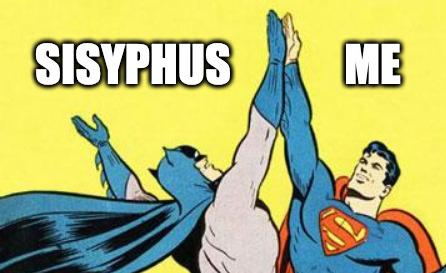

## So I put a website in my website so you can website while you website.

Okay more accurately, project pages now load the project website into an iframe where possible.

I put them in a little fake browser window which shows the URL, allows you to toggle a fullscreen mode, and encourages you to resize the “window” to your heart’s content. It’s not the most resource-efficient approach, but it is fun!

And for projects that can’t be loaded into an iframe, I now display an image or series of images. A picture of a website isn’t as good as a website, but in some cases it’ll have to do.

## How did we get here?

A few years back, I made the decision to only show my projects in the form of as links to live websites.

One main reason for this decision: a lot of time and work can go into screenshotting and mocking up and writing about projects for individual project pages, and I wanted to make it relatively painless for me to keep my website updated.

The other main reason: at the time, I had enough live projects to be proud of. The thinking was, you want to see what I do? Here are living examples of what I do.

Alas, one of the least fun parts about working on websites is how our work fades away with time. Former clients rebrand and redesign, companies go under, technology evolves, money runs out, servers go down.

As of late, most of what I wanted to link to can no longer be linked to.

## The abandoned and decayed | reassembled and remade

Those are lyrics from my song [Revived](https://thewelcoming.bandcamp.com/track/revived). I wrote them about the experience of bringing back old song ideas from the dead — and the joy of finally releasing them into the world.

I’ve recently done the same with some dead client websites, although the process was decidedly less joyful than writing music. That said, I’m happy to have brought them back for posterity.

## Good old days

There are a few relatively recent client sites (some yet unpublished) that I made with [NextJS](https://nextjs.org/) or [SvelteKit](https://kit.svelte.dev/). [Netlify](https://netlify.com) made the process of hosting them pretty painless, although I did remove multilingual functionality since it wasn’t playing nicely with the static build.

In addition, I brought back a series of websites that I originally built with [Kirby CMS](https://getkirby.com) during my time working at Berman Advertising. They were made using version 2 of the CMS and the process of [upgrading them to version 3](https://getkirby.com/docs/cookbook/setup/migrate-site) wasn’t quick, but I went ahead and did so in order to use this neat [Kirby3 Static Site Generator plugin](https://github.com/d4l-data4life/kirby3-static-site-generator) and host them on Netlify. They’re no longer editable via the Kirby admin panel, and some features such as pagination and search no longer work since they’ve been converted to static sites, but that’s okay. Like an album, they represent an snapshot in time.

## I cannot save you | I can’t even save myself

That brings me to the projects I couldn’t restore.

Some of the coolest stuff I’ve worked on to date was done at [Datawheel](https://datawheel.us), but due to the nature of the project contracts, they were typically handed off to be maintained ([or not](https://github.com/datachile/datachile/issues/611)) by other entities. And since they were data-heavy websites which relied heavily on APIs, when the APIs stopped working, the archived versions of the sites stopped displaying the data as well. For most of these I have access to a git repo, but not the database or APIs.

At time of writing, [Codelife](https://en.codelife.com/) and the [CDC Patient Safety Portal](https://arpsp.cdc.gov) are still up, but most of the rest of the stuff I worked on at Datawheel is not. I’m especially sad that [Open Source Compass](/projects/open-source-compass) is gone — it was the first project where I was able to lead the development team, and we spent a lot of time getting all the UX details perfectly dialed in.

Oh well, what can you do? 🤷‍♂️

## Wonder what’s next

At time of writing, I have not yet written project descriptions. But context is king, so I will be working on this soon!

And, appropriately, since Gridsome [seems to be dead](https://github.com/gridsome/gridsome/issues/1459), I will need to rebuild this website again at some point (_gives Sisyphus a rad high five_).

