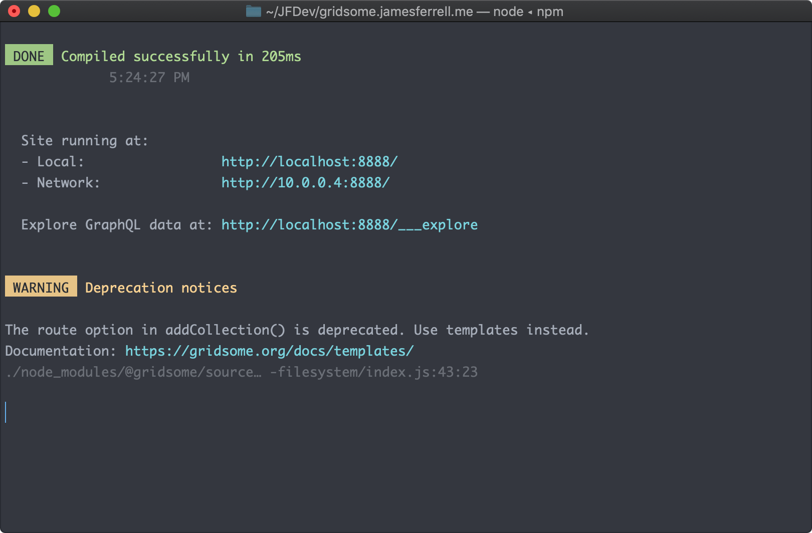

Hi there. How've you been? Oh, make yourself at home.

Oh, why *yes*, my website *is* now built with Javascript — it's so nice of you to notice.

What a world, am I right? The last time I did any work on this website — way back in 2017 — I was still mildly terrified of Javascript, and today I'm throwing out arrow functions and spreads and destructured variables like candy.

## Vue and GraphQL? Isn't that overkill?

Okay, yes — no, you're right — this is a relatively small portfolio site with a few pages and a blog. I've gotten by with minimal Javascript up until now. Yes, there's a newer version of [Kirby CMS](https://getkirby.com/v3), and honestly it looks great. Kirby is still my favorite CMS that requires a server, hands down.

## Severing ties with the server

But like, that's one of the things I'm tired of dealing with. That whole _server_ thing.

I no longer need to pay for hosting or log into some clunky hosting panel any more, because the files are hosted on the [Github repo](https://github.com/perpetualgrimace/gridsome.jamesferrell.me). When I push my changes, [Netlify](https://netlify.com) automagically rebuilds and redeploys the live site. If that's not deserving of a rocket ship emoji or three, I don't know what is! 🚀🚀🚀

Also, webfaction, one of the very few hosts that I've enjoyed using, was [bought out by godaddy](https://community.webfaction.com/questions/21806/webfaction-joins-forces-with-godaddy).

Finally, I'm using [Netlify Forms](https://www.netlify.com/products/forms/) for my [contact](/contact) page, which was pretty easy to set up. Man, remember when submitting a form used to require a server? Not any more. 😌

## * *gulp* *

You know what, that is _exactly_ what I do every time I need to spin up a legacy site, because because I know that at some point I updated node and/or npm, which means that gulp will no longer run and I'll need to update it, which means that my build will no longer run because the syntax I originally used was depreciated.


Gridsome uses webpack under the hood, but even though it's a young project, they have [pretty good docs around configuration](https://gridsome.org/docs/config/) and for the most part there isn't a ton of stuff that you need to configure. Convention over configuration baby!

And, wouldja look at that terminal output? A nice, concise list of useful information, helpful depreciation messages, it's just...*mwah*! 👨‍🍳



## The module reloading is so spicy

You know, even when the build step ran correctly, it still had to refresh the entire page if you made any changes to the php templates or content. Nice that the reload can happen automatically, but at this point I'm pretty spoiled by the hot module reloading in modern javascript frameworks, just updating that one thing you're working on.

## I like my web apps like I like my music — progressive

You know, I care about accessibility and performance, so it's very important to me that all users of my sites get a good baseline experience.

And visitors with more capable browsers get a fancier version of the site. You're probably already aware, but this is known as Progressive Enhancement™. All the ~~cool~~ responsible kids are doing it.

With that in mind, one of the main reasons I chose Gridsome is that it generates a static version of the site which anyone can access, which is then `hydrated™` into a single page app for users with Javascript enabled.

Or you might have javascript disabled right now, and I stand with you.

## Gotta go fast

Another reason I went with Gridsome is for the performance benefits. The static version of the initial page loads fast. Images are lazy loaded in at the right resolution for the current screen. The Javascript hydration happens fast, and once it does, links to new pages are stupidly fast — basically instantaneous.

Go ahead, click some links. I'll wait.


## Why Gridsome over Gatsby?

At [Datawheel](http://datawheel.us) I work in React day to day, and have never particularly liked it *(that's its own blog post)*. I've heard nothing but positive things about Vue, and felt like this was a good opportunity to dive in and give it a spin.

And after spending some time with it, I do enjoy using Vue. In a Vue component, the HTML is HTML, the business logic is mostly kept away from the markup, a putting the component styles in a style block within the same file actually makes a ton of sense. Separation of concerns, meet approachability.

## Downsides:

### GraphQL more like...AssQL

Okay that's not fair. GraphQL is cool tech, especially if your content comes from lots of different places. But GraphQL really does feel like overkill for a project of this size. It's super cumbersome. I wish I could point Gridsome at a markdown file and let it figure what's available from the front-matter, rather than having to explicitly define each field.

### Defining routes in...plugin config?

The process of configuring the entities and routes is...weird. For example, a static page which renders a collection of articles must be defined in the config like:

```
plugins: [
  ...
  {
    use: "@gridsome/source-filesystem",
    options: {
      path: "content/blog.md",
      typeName: "Blog",
      route: "/blog"
    }
  }
  ...
]
```

And then the individual articles, using the `vue-remark` plugin, are defined like:

```
plugins: [
  ...
  {
    use: "@gridsome/vue-remark",
    options: {
      baseDir: "content/articles",
      typeName: "Article",
      template: "./src/templates/Article.vue",
      route: "/blog/:slug"
    }
  }
  ...
]
```

This might be a case of the team following the example of Gatsby a bit too closely. Defining an entire site full of pages and templates individually like this just feels overly verbose and I wish it could be more automatic.


### Unremarkable

With Gridsome, markdown is clearly not a first class citizen. With Kirby CMS, anything can be parsed from markdown to HTML at any point by chaining in a method, and that's really powerful. That's not the case here.

There _is_ now an official plugin which allows you to [add Vue components inside your markdown files](https://gridsome.org/plugins/@gridsome/vue-remark), which I found *essential*. I actually started rebuilding this site with Gridsome back in June, but hit a brick wall during which I just had to wait for the plugin to be released.

## How do they do it?

As far as I can tell, the Gridsome team basically consists of two people working on recreating Gatsby in Vue. For such a small team working for such a short amount of time, I'm amazed at the level of polish, the number of well-implemented features, the growing plugin ecosystem, and the surprisingly good documentation.

## Did I make the right choice?

I'm glad I made the jump. I had to make some changes in the way I store my content and assets, but overall, between the good Gridsome docs, the responsiveness of the Gridsome community, the approachability of Vue, and my current level of experience with Javascript, rebuilding my site with gridsome was relatively painless. And I really like the snappy, *appy* feel and developer experience now that everything is in place.

Also, it was a good learning experience.

Thanks for reading, and I encourage you to go check out [Gridsome](https://gridsome.ord).
