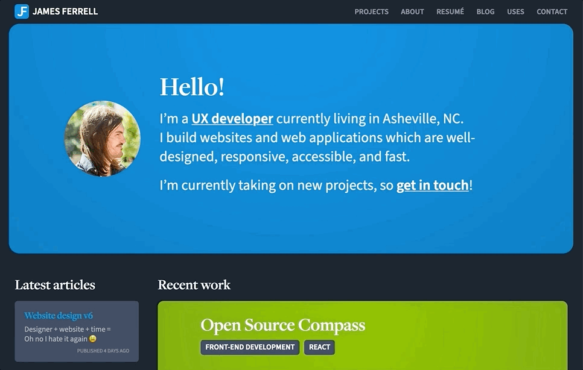

Welp, it happened. Time passed, the world changed, my skills improved, and I found myself hating my website again. 😅

## It’s funny how each design is a reflection of the time in which I made it

From “I need a website so I can get a job” (versions 1 & 2) to “the creative director insists on a flashy hero image and extremely limited layout, colors and typography for every website, so I’ll do the opposite” (version 4). Version four was the last major redesign of the site — just over three years ago at time of writing. I put in a totally superfluous fixed sidebar just because I wanted to do something different and overcomplicated for the fun of it.

Then in early 2020, for version five, I did the purely technical exercise of [rebuilding the site using Vue](/blog/gridsome) after two years of focusing primarily on front-end React development at Datawheel.

Since then I’ve been walking back some of the design decisions I made in version four. Mainly, I removed the sidebar, which resulted in a lot of design issues. I hacked away a few times but nothing felt right. Sometimes designing in the browser works, but sometimes you only wind up making things different, not better. 

It was time to go back to the drawing board.

## The process

I started out by doing what I do at the beginning of any project — I made lists. Things I wanted to fix, things I wanted to try, and things I still liked. After taking stock, there were many elements that still worked, so I went with more of an iteration than a full on redesign.

I actually only spent one day working in Sketch before landing on the current direction. The theme for me was consolidation and simplification. The biggest changes involved nav, header, and footer redesigns, dark mode, and layouts.

## Using CSS grid

Since layout was a main focus this time around, it felt like a good time to dive into [css grid](https://css-tricks.com/snippets/css/complete-guide-grid/).

Honestly I’ve been reluctant to use it for client sites, because there is a 100% chance the client would ask me why the site looks broken in IE or whatever, and then I would wind up building a fallback layout that works on older browsers and satisfies the client — in addition to the fancy grid layout which was supposed to make my life easier. 

But this is *my* website. Also, enough time has passed that [grid now has good browser support](https://caniuse.com/css-grid).

I started with simple, [non-broken, stacked layouts](https://briefs.video/videos/is-progressive-enhancement-dead-yet), and then used grid as an enhancement. And after spending some time with grid, it really is very cool and easy to learn. 

It also enables some things that wouldn’t be possible otherwise. For example, I couldn’t have pulled off this responsive home page hero layout without duplicating and toggling the visibility of elements at different screen sizes:

I did happen to stumble into some grid pitfalls:
- Combining `display: grid` with `max-width/max-height: 100%` (used in conjunction with `margin: auto` alignment of children) caused a weird bug in Safari which made the container grow in height when resizing the window (⁉️)
- Shifting a container out into the gutter area (via negative margin, width, or a nested container) causes the grid areas to become offset, requiring what felt like hacks in order to get everything lined back up

Finally, it could be my lack of experience with grid and the way I structured my markup, but I found myself really wishing browsers supported subgrid already. I actually faked it on the [about](/about) and [resumé](/resume) pages by increasing the container width and setting `grid-column` to `repeat(14, 1fr)`. Check those pages out if you’re looking at this on a big screen. 😁

## Dark mode

Dark mode wound up being my favorite addition, and it also happened to require the least amount of time and effort to implement. I added dark mode to the admin panel for [the world’s most complicated CMS](https://github.com/Datawheel/canon#readme), so this was nothing. I simply made a `dark-mode` scss mixin — an alias for the `prefers-color-scheme: dark` media query — and added the dark mode styles at the end of each declaration as necessary. 

It’s likely that no one would notice, but there is very a subtle transparent gradient overlaid on certain elements which changes from white to black, subtly lightening or darkening the background depending the active theme. Details. 🤓

## Where’s the new stuff?

One thing I didn’t wind up touching was my work. Unfortunately many of the projects I worked on in 2020 either haven’t moved into production yet, or are confidential, or both. But please [get in touch](/contact) if you’d like to see — oops, my elite team of lawyers have encouraged me not to finish that sentence. 😉

## My goal for each redesign is to be happy for at least a year

It’s hard to be objective about the way you present yourself, but I think this time around I managed to make things not just different, but better.
